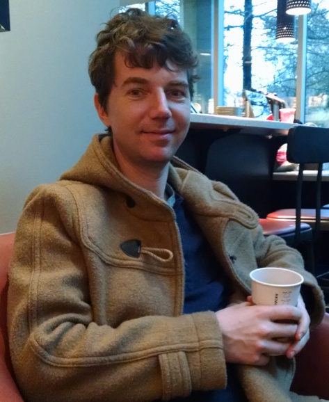

I'm a PhD graduate in neuroscience from [Nick Swindale's](http://swindale.ecc.ubc.ca) lab at
[UBC](http://ubc.ca). As of 2016, I'm a postdoc in [Laura
Busse's](http://www.cin.uni-tuebingen.de/research/research-groups/junior-research-groups/cortical-circuits-of-visual-perception/research-directions.html)
lab at [LMU München](http://www.en.biologie.uni-muenchen.de) in Germany, formerly at the
[University of Tübingen](https://www.uni-tuebingen.de/en.html).

My interests lies in [computational
neuroscience](https://en.wikipedia.org/wiki/Computational_neuroscience), specifically the
activity of neural assemblies in the brain during naturalistic stimulation and varying
brain states, and at millisecond timescales. I have a notion that what we learn about the
rules of neural interactions governing perception, memory, decision making and ultimately
behaviour, can be generalized to other complex systems of interacting agents -- like, perhaps,
human beings making up a society. This might be a naïve notion.

I have three public projects here: [dimstim](http://dimstim.github.io),
[spyke](http://spyke.github.io), and [neuropy](http://neuropy.github.io). The first generates
multidimensional visual stimuli with high temporal precision. The second takes raw
extracellular neural waveforms and sorts them into spikes from distinct neurons. The third
analyzes spike trains in as many ways as possible. In the Busse lab, I'm mostly using an
internal project based on [datajoint](http://datajoint.io) for organizing and analyzing data.

Here's my PhD thesis (June, 2015): [Characterizing patches of primary visual cortex with
minimal bias](mspacek_thesis.pdf)

Here's the resulting manuscript based on one of the chapters: [Cortical state and natural
movie responses in cat visual cortex](http://dx.doi.org/10.1101/031765)

Here's my [GitHub account page](http://github.com/mspacek) and my former [lab
page](http://swindale.ecc.ubc.ca/MartinSpacek).
